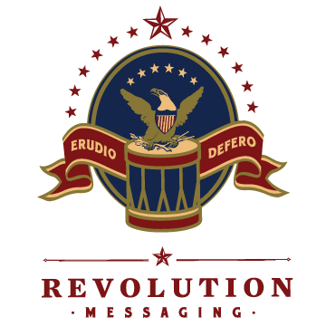
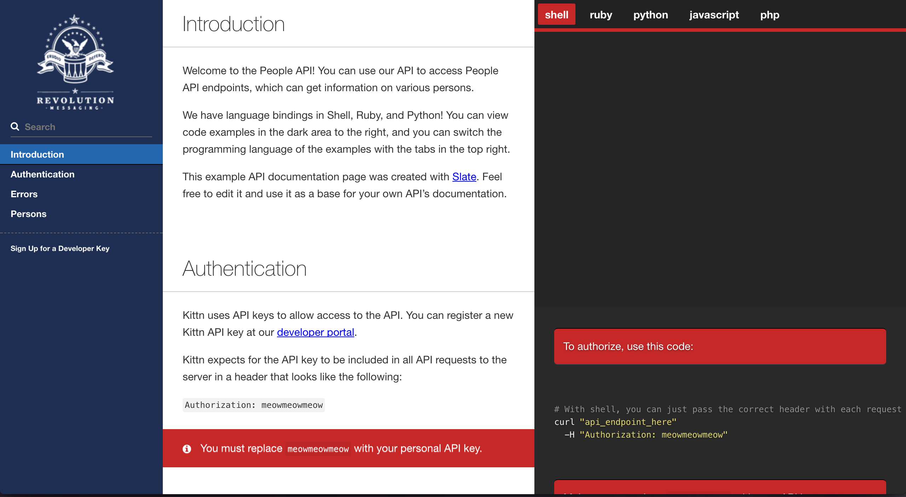

<p align="center">
  
  <br>
</p>

<p align="center"></p>

<p align="center"><em>The example above was created with Slate. Check it out at <a href="https://lord.github.io/slate">lord.github.io/slate</a>.</em></p>

# Introduction

This is a template for API documentation for anything publicly and internally exposed in Revere. It is based on [slate](https://github.com/lord/slate). 

# Purpose 
This exists to create a consistent api doc between all revere products. We can own this documentation. 


# Contributing
Please feel free to contribute and follow the development setup below! **Fork this repo please!**

# Development Setup 

First clone this project 

```
git clone https://github.com/revolution-messaging/revere-api-documentation-template.git && cd revere-api-documentation-template
```

A Dockerfile, and a docker-compose files are provided for setting up and running a development environment. If you're familiar with docker you can skim over the details.

## Setup & Installation

Install docker from [here](https://docs.docker.com/engine/installation/) for your system. You should now also have docker-compose in your command terminal. 

Ensure docker is running the background on your machine then we can start the build.

```
docker-compose up
```
to start the application. Then visit `localhost:4567` to ensure the application is running.

# Build Deployment

Before pushing documentation to a repository please build and commit the build folder as well. We can then pull from this folder across all documentation to get the latest updates.

To build your documentation with docker run:

```
docker run --rm -v $PWD:/usr/src/app/source -w /usr/src/app/source reveresyncv2apidocs_app bundle exec middleman build --clean
```